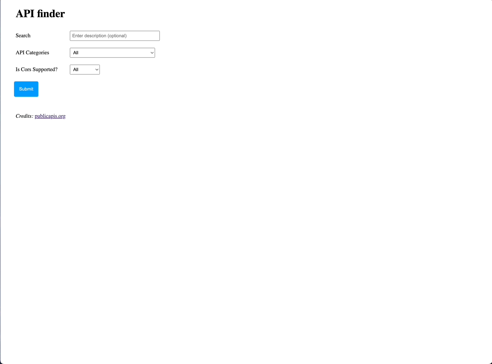

# Demo

# Purpose:

The purpose of this assignment was to find a free api from [Mixed Analytics](https://mixedanalytics.com/blog/list-actually-free-open-no-auth-needed-apis/) and do something useful with it. The apis found in the link are all free, and require no authentication. While I appreciate someone compiling this list, I felt like it was lacking in the amount they had (82). The api I chose was [Public APIs](https://api.publicapis.org/) which list's some public api's (1425). For this assignment I added the, is cors enabled filter, is the api https enabled filter, dropdown for all the categories that are available, and an input for searching.

# Contents:

1. index.html - The website itself.

2. styles.css - Styling of page, including some neat table styling.

3. script.js - Performs the api calls when submit button is pressed, fills the categories on site load, and dynamically changes the contents inside the table for the results.

# Note:

## I noticed the maintainers of the api haven't been active on github anymore. Some links might be out of date. At some point this page might stop working? 

[Issues with maintainers](https://github.com/public-apis/public-apis/issues/3104)